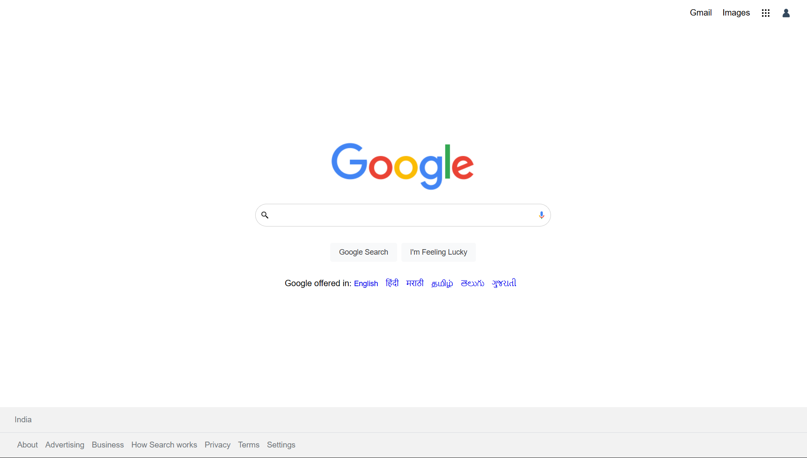

Google Homepage Clone
A simple, responsive recreation of the Google Search homepage built using pure HTML and CSS. This project focuses on layout accuracy, flexbox alignment, and mimicking the clean aesthetic of Google’s UI.

You can view the live version of this project here:

 Features
Pixel-Perfect Header: Includes "Gmail" and "Images" links along with the profile and apps icons.

Search Interface: Recreates the iconic Google logo, search bar with voice/lens icons, and the "Google Search" and "I'm Feeling Lucky" buttons.

Footer Navigation: A multi-layered footer with location data and links for Advertising, Business, and Privacy.

Responsive Layout: Uses CSS Flexbox to ensure elements stay centered regardless of screen size.

🛠️ Technologies Used
HTML5: For the semantic structure of the page.

CSS3: For styling, including:

Flexbox: For centering the search container and aligning header/footer items.

Hover Effects: Adding shadows and transitions to buttons and the search bar.

Google Fonts: Utilizing the "Roboto" or "Arial" look for branding accuracy.

📂 Project Structure
Plaintext
Google-hoomepage/
│
├── index.html    # The main structure of the page
├── style.css     # All styling and layout rules
└── assets/       # Folder for images/icons

⚙️ How to Run Locally
Clone the repository:

Bash
git clone https://github.com/Adhieeeh/Google-hoomepage.git
Navigate into the project folder:

Bash
cd Google-hoomepage
Open index.html in your favorite browser.

 Future Improvements
Add a functional search bar that redirects to actual Google search results.

Implement a "Dark Mode" toggle.

Add the dropdown "Apps" menu functionality using JavaScript.

 Contributing
Contributions, issues, and feature requests are welcome! Feel free to check the issues page.

Created by Adhieeeh
